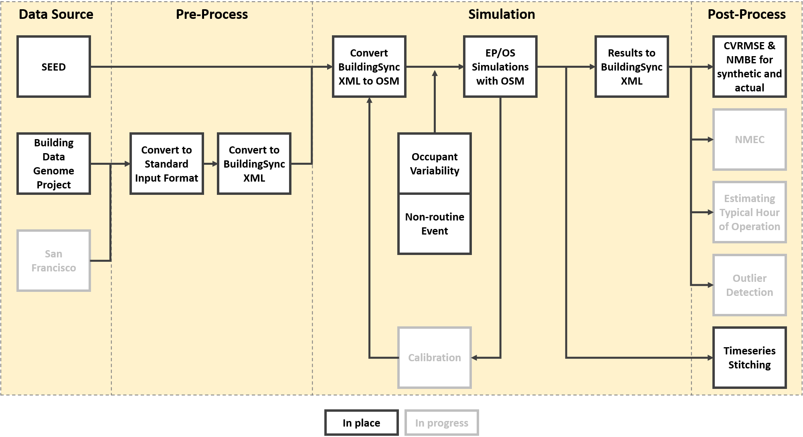
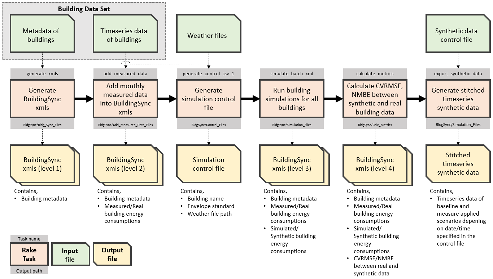

# Energy Data Vault (EDV) Synthetic Data Creation Workflow Development

- Developing/Modifying/Fixing the workflow to answer questions below.

  - Phase 1: Does synthetic smart-meter data sufficiently represent variability and other characteristics of real data ?
  - Phase 2: Can synthetic smart-meter data sufficiently calibrated based on real data ?
  - Phase 3: Is the workflow automated properly, and is the ReadMe describing all relevant information ? 


## Synthetic Data Creation Workflow

- Schematic below indicates the entire scope considered in the synthetic data creation as well as current status of the workflow.




## Installation

- Install Ruby and OpenStudio

  - Current working versions,
    - [Ruby 2.2.4](https://rubyinstaller.org/downloads/archives/)
    - Bundler 1.17.1 (use ```gem install bundler -v 1.17```)
    - [OpenStudio 2.9.0](https://github.com/NREL/OpenStudio/releases/tag/v2.9.0) 
  - [Instruction](https://github.com/NREL/openstudio-extension-gem/blob/0.1.X-LTS/README.md) for current working versions.

- Clone this repo and run
```
bundle install
```
```
bundle update
``` 

- TODO,
  - update installation instructions when transitioning to OpenStudio 3.0 and Ruby 2.5.x

## Script Overview

The following figure contains an overview of the scripts and input as well as output files/paths:





## Configurations Before Running the Entire Workflow

- ```constants.rb``` file under ```scripts``` folder includes configurations of the EDV workflow to specify, 
  - selection of the **data source** and where is the data read from
  - simulation types between **baseline only** versus **considering all scenarios**
  - **directories** of input and output files 
  - application of **variability** in buildings ([occupant related variability](https://github.com/LBNL-ETA/OpenStudio-Occupant-Variability-Gem) & [other variability](https://github.com/LBNL-ETA/OpenStudio-Variability-Gem))

- Sample template files for metadata and timeseries data that represent the standard input format are included under ```data/raw``` folder

  - full set of metadata labels that can be used in this workflow are,
    - ```building_id```
    - ```xml_filename```
    - ```primary_building_type```
    - ```floor_area_sqft```
    - ```vintage```
    - ```climate_zone```
    - ```zipcode```
    - ```city```
    - ```us_state```
    - ```longitude```
    - ```latitude```
    - ```number_of_stories```
    - ```number_of_occupants```
    - ```fuel_type_heating```
    - ```energystar_score```
    - ```measurement_start_date```
    - ```measurement_end_date```
    - ```weather_file_name_epw```
    - ```weather_file_name_ddy```
    
  - format of timeseries file can be referred to the template file ```timeseriesdata_template.csv``` and the column headers representing the building id should match with ```building_id``` in the metadata file.

- Custom weather data can be stored in ```data/weather``` folder 


## Executing the Workflow: Group Executions

### Group1: Step 1-3

- Steps 1 - 3 of the workflow (described in "Executing the Workflow: Step-by-step for Every Task") are aggregated into a single Rake task.
```
bundle exec rake workflow_part_1
```
- The Rake task makes the following assumptions:
  - The user has cloned the edv-experiment-1-files (where building/weather data are stored separately) repository and it is at the same level as the edv-experiment-1 dir, i.e.
    ```
    dir/edv-experiment-1
    dir/edv-experiment-files
    ```
  - The ```edv-experiment-1-files/bdgp_with_climatezones_epw_ddy.csv``` is used for Step 1.

- By the end of the run, all outputs from Steps 1 - 3 should be available.


## Executing the Workflow: Step-by-step for Every Task

### Step 0 (optional): Convert raw data format from Building Data Genome Project to standardized input format

- Run the following command to convert raw data to standardized format:
```
bundle exec rake standardize_metadata_and_timeseriesdata
```

- This step is only necessary when [Building Data Genome Project](https://github.com/buds-lab/the-building-data-genome-project/tree/master/data/raw). data is being used.

- This step can be skipped if importing [BuildingSync](https://buildingsync.net/) XML files from [SEED](https://bricr.seed-platform.org/).

### Step 1: Generate BuildingSync XMLs from standardized building metadata

- Run the following command to generate BuildingSync XMLs from CSV data:
```
bundle exec rake generate_xmls
```

- The generated XML files will be saved in a location specified in the configuration ```constant.rb``` file.

- This step can be skipped if importing [BuildingSync](https://buildingsync.net/) XML files from [SEED](https://bricr.seed-platform.org/).

- TODO,
  - standardize data intake process
    - standard building metadata format
    - standard building timeseries data format

- Note,
  - make sure not to commit data including private information to this repo.

### Step 2: Add measured data into BuildingSync XMLs from standardized timeseries data  

- Run the following command to add measured energy consumptions to the BuildingSync XMLs generated in step 1:
```
bundle exec rake add_measured_data
```

- The updated XML files will be saved based on the configuration in ```constant.rb``` file.

- Currently, monthly total consumptions are only calculated and stored back to xmls.

- This step can be skipped if importing [BuildingSync](https://buildingsync.net/) XML files from [SEED](https://bricr.seed-platform.org/).

- TODO,
  - add capability for adding granular (e.g., daily, hourly) timeseries data to xmls. 

### Step 3: Generate the simulation control file

- The following script will generate a csv file that includes combinations of BuildingSync XML files and weather files to create scenarios of EnergyPlus/OpenStudio simulations. 
```
bundle exec rake generate_control_csv_1
```

- The output control file contains the name of the BuildingSync file, the Standard to define buildings, and weather file names.

- The output control file will be saved based on the configuration in ```constant.rb``` file.

- Users need to acquire weather files (EPWs and DDYs) separately.

- TODO,
  - standardize the format of the csv file (3rd argument) that includes connection between buildings and weather files.

### Step 4: Run building simulations (generate synthetic data) for all buildings

- Run the following command to translate BuildingSync XMLs to OSMs/OSWs and run all related simulations:
```
bundle exec rake simulate_batch_xml
```

- The generated simulation files as well as updated BuildingSync XMLs will be saved in the NAME_OF_OUTPUT_DIR/Simulation_Files directory.

- Detail processes/capabilities of this step is also shown in the "Overall Workflow of Synthetic Smart-Meter Data Creation" above.

### Step 5: Calculate metrics based on information from both real and synthetic data

- Run the following command to calculate Actual EUI, Modeled EUI, CVRMSE, and NMBE from measured and simulated electricity data.
```
bundle exec rake calculate_metrics path/to/simulation/results/created/from/previous/step
```

- Currently, metric calculations based on monthly data are only possible.

- TODO,
  - include capability for granular (e.g., daily, hourly) timeseries data.

### Step 6: Generate stitched timeseries synthetic data

- The following script will create a single timeseries data that includes both pre- and post- interventions (e.g., energy efficiency measure, non-routine event) by stitching them together based on the definitions of when interventions happened. The scenarios for defining interventions are configured in another csv file. 
```
bundle exec rake export_synthetic_data path/and/name/of/configuration/csv/file
```

- The format of the configuration file is shown [here](https://github.com/NREL/edv-experiment-1/blob/develop/spec/files/generation_script.csv)


