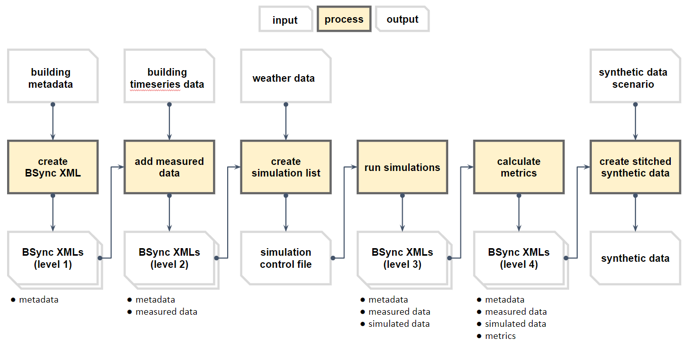
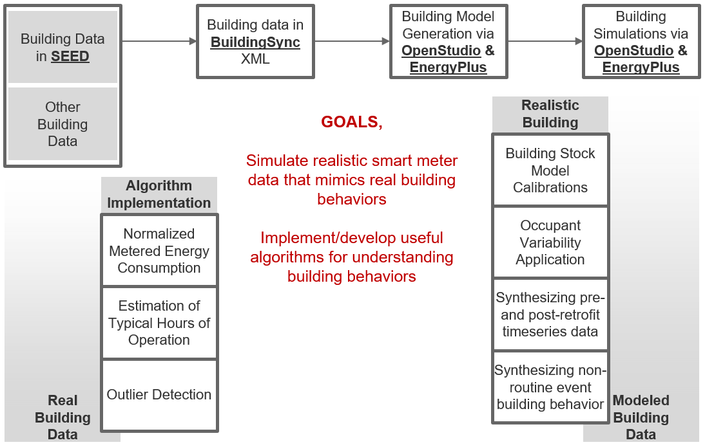

# Energy Data Vault (EDV) workflow development

- Developing/Modifying/Fixing the workflow to answer questions below.

  - Phase1: Does synthetic smart-meter data sufficiently represent variability and other characteristics of real data ?
  - Phase2: Can synthetic smart-meter data sufficiently calibrated based on real data ?

## Installation

- Install Ruby and OpenStudio

  - [Instruction](https://github.com/NREL/openstudio-extension-gem/blob/0.1.X-LTS/README.md)
  - Current working versions,
    - [Ruby 2.2.4](https://rubyinstaller.org/downloads/archives/)
    - Bundler 1.17.1 (use ```gem install bundler -v 1.17```)
    - [OpenStudio 2.9.0](https://github.com/NREL/OpenStudio/releases/tag/v2.9.0) 

- Clone this repo and run

``` bundle install ```
``` bundle update ```

## Output path

All output will go into a path this is defined with the constant NAME_OF_OUTPUT_DIR in the constants.rb file, 
below the edv-experiment-1 main folder. 

## Script overview

The following figure contains an overview of the scripts and input as well as output files/paths:




## Overall workflow of Synthetic Smart-Meter Data Creation



## Step 1: Generate BuildingSync XMLs from building metadata

Run the following command to generate BuildingSync XMLs from CSV data:

``` bundle exec rake generate_xmls path/to/csv/file ```

The generated XML files will be put in the NAME_OF_OUTPUT_DIR/BldgSync directory.

This script is designed to work with the metadata `meta_open.csv` from the [Building Data Genome Project](https://github.com/buds-lab/the-building-data-genome-project/tree/master/data/raw).

*Note*: Do not commit generated BuildingSync XMLs to this repo.  Do not commit the CSV data to the repo either.\

## Step 2: Add monthly measured data into BuildingSync xmls 

Run the following command to add measured monthly energy consumptions to the BuildingSync XMLs generated in step 1:

``` bundle exec rake add_measured_data path/to/csv/file/with/measured/data path/to/dir/for/resulting/xml/files```

## Step 3: Generate the simulation control file

The following script will generate a csv file with all BuildingSync files found in the NAME_OF_OUTPUT_DIR/Bldg_Sync_Files directory. 

``` bundle exec rake generate_control_csv_1 path/to/bldg_snyc_files (optional) standard_to_be_used csv/file/with/EPWs path/to/weather/files```

The first argument is required and should be the path to the BuildingSync files
The other three arguments are optional. The 2nd one can set the standard (ASHRAE 90.1 or T24), 
the 3rd and forth can also use actual weather files based on the related csv file and a path to the weather files

## Step 4: Run building simulations for all buildings

Run the following command to translate BuildingSync XMLs to OSMs/OSWs and run all related simulations:

``` bundle exec rake simulate_batch_xml path/to/csv/file ```

In this case the CSV file contains the name of the BuildingSync file, the Standard to use and the weather file in comma separated format.

The generated simulation files will be put in the NAME_OF_OUTPUT_DIR/SimulationFiles directory.

## Step 5: Calculate metrics based on information from both real and synthetic data

Run the following command to calculate Actual EUI, Modeled EUI, CVRMSE, and NMBE from measured and simulated monthly electricity data to the BuildingSync XMLs

``` bundle exec rake calculate_metrics path/to/dir/with/simulation/results```


## Step 6: Generate stitched timeseries synthetic data

The following script will export data according to the instructions in the csv file. 

``` bundle exec rake export_synthetic_data path/to/csv/file```

The csv file contains: the following rows:
- realization_name
- basic_scenario_dir
- building_id
- default_scenario
- start_date
- end_date
- scenario_name_1
- active_after_1
- scenario_name_2
- active_after_2
- ...

## Shortcut Workflow for Step 1-3
Steps 1 - 3 of the workflow have been aggregated into a single Rake task.
```
bundle exec rake workflow_part_1
```
The Rake task makes the following assumptions:
1. The user has cloned the edv-experiment-1-files repository and it is at the same level as the edv-experiment-1 dir, i.e.
    ```
    dir/edv-experiment-1
    dir/edv-experiment-files
    ```
2. The `edv-experiment-1-files/bdgp_with_climatezones_epw_ddy.csv` is used for Step 1.

By the end of the run, all outputs from Steps 1 - 3 should be available.


